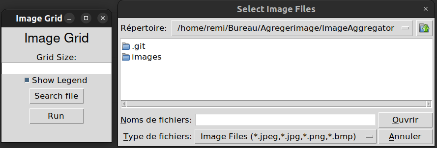
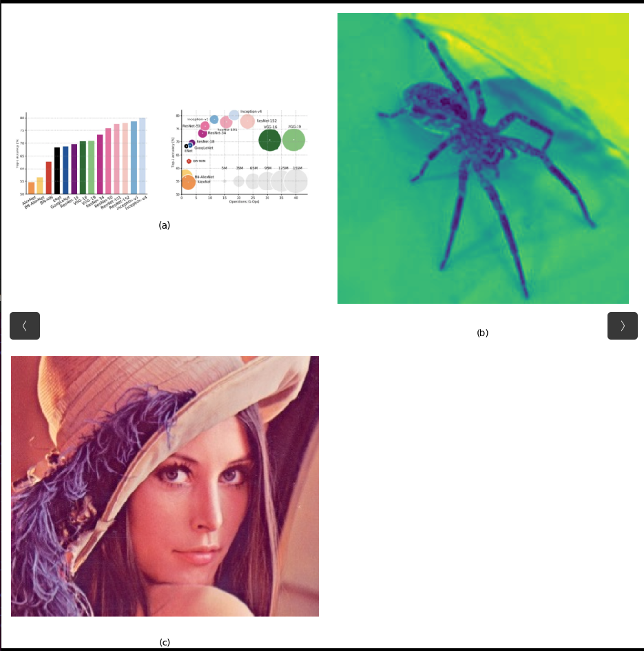
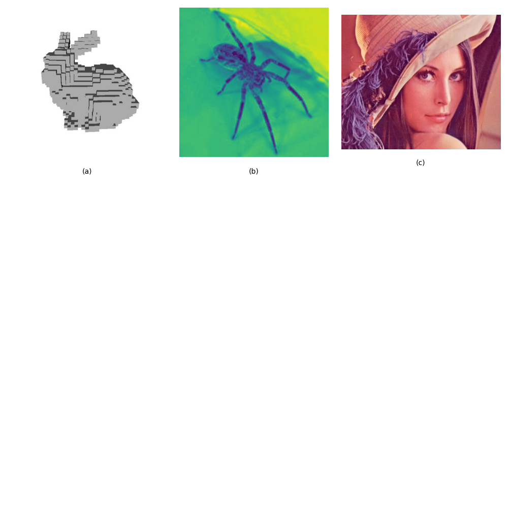

# ImageAggregator
Aggregate image and annotate it easily in Python with a Tkinter user friendly interface



## Features
- Choose the number of images in a row
- Choose your files
- Choose to annotate with (a),(b)...(z)

# Run from executable

run dist/ImageAggregator

# Run from source

## Requirements
```
pip install -r requirements.txt
```
## Run
```
git clone https://github.com/Rlhoste/ImageAggregator.git
cd ImageAggregator
python3 ImageAggregator.py
```
the result is saved at the root of the python file

## Examples






